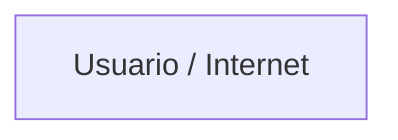
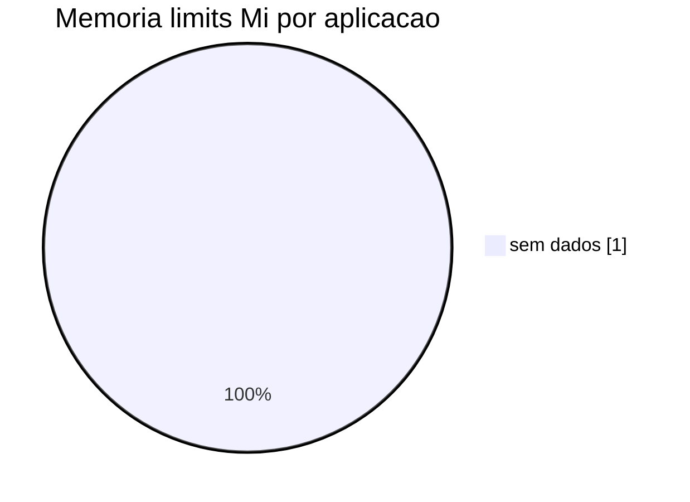
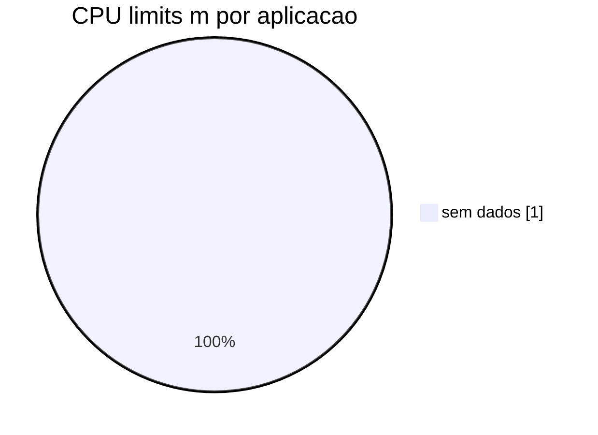
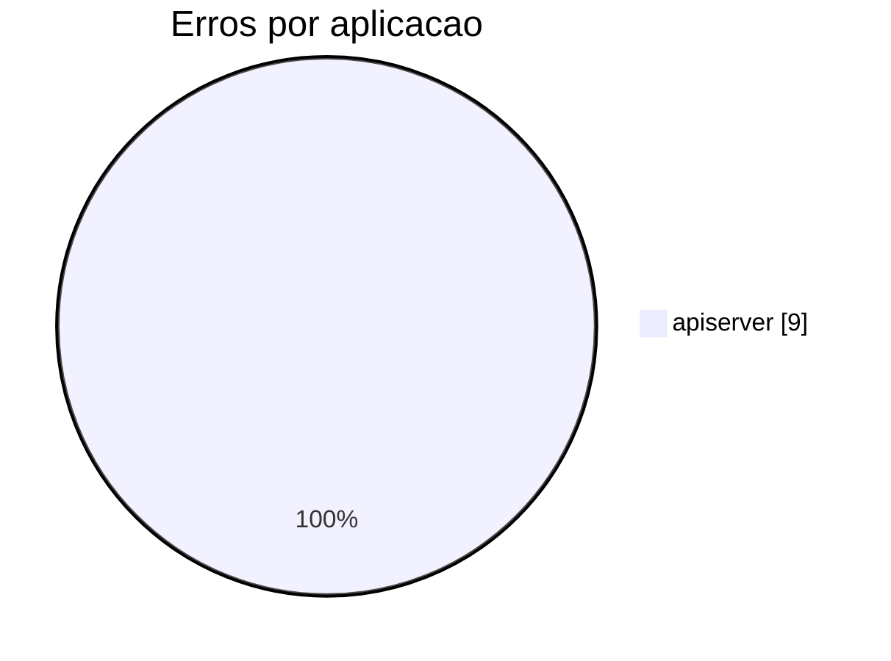
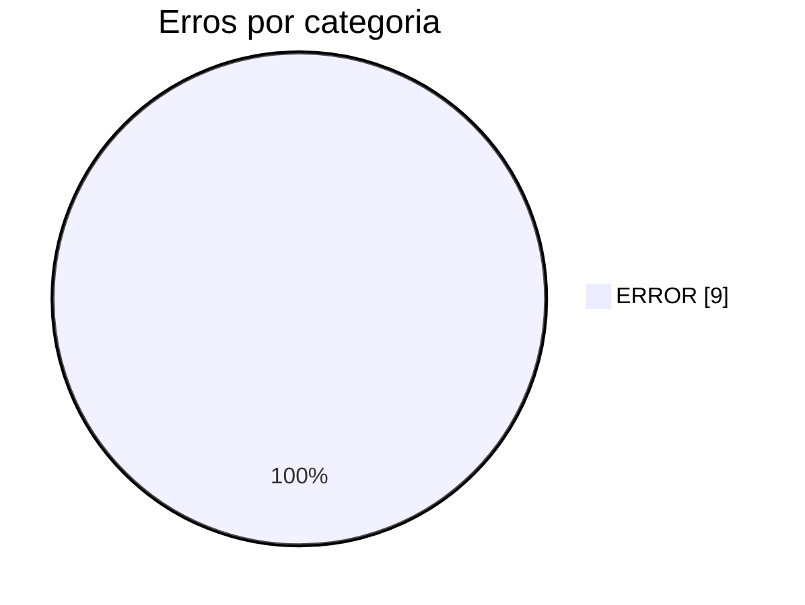

# Relatório de assessment OpenShift

_Gerado em 2026-08-09 15:17 UTC (análise local, sem LLM)_
_Artefatos: `/app/data/assessment/openshift-apiserver`_

## Sumário executivo

- Namespace `openshift-apiserver`: **2** apps, **0** achados (alto=0, médio=0, baixo=0), **9** ocorrências em logs, **0** indícios sensíveis em ConfigMaps
  - CPU req/lim: **0m** / **0m** · Memória req/lim: **0Mi** / **0Mi**
  - Workers: **1** nodes · CPU allocatable **7800m** · Mem allocatable **23572Mi**

---

## Namespace `openshift-apiserver`

### Inventário

- Aplicações: **2** (`api, check-endpoints`)
- Deployments/workloads: **2**
- Services: **4**
- Routes: **0**
- ConfigMaps: **18**
- ClusterServiceVersions (operadores): **0**
- Arquivos de log: **1**

### 2.6 Operadores presentes no namespace (ClusterServiceVersions) — `openshift-apiserver`

CSVs analisados: **0** · listados: **0**

| Operador (displayName) | CSV | Versão | Phase | Upgrade disponível | Provider | Evidência |
|------------------------|-----|--------|-------|--------------------|----------|-----------|
| — | — | — | — | — | — | Nenhum CSV em `resources/clusterserviceversions*` |

Coluna **Upgrade disponível**: valor da propriedade `status.state` (no CSV ou na Subscription OLM correspondente). Exemplos: `AtLatestKnown`, `UpgradeAvailable`, `UpgradePending`, `UpgradeFailed`. Sem `status.state` nos artefatos, infere-se pelo `currentCSV` do PackageManifest (canal default); `—` se não houver evidência.

Os CSVs indicam operadores disponíveis via OLM no escopo coletado; não implicam, por si só, ServiceMonitor/PodMonitor/PrometheusRule configurados para as aplicações do namespace.

### Achados de configuração — `openshift-apiserver`

Nenhum achado pelas heurísticas locais.

### Arquitetura reversa — `openshift-apiserver`

Visão simples reconstruída a partir de **Deployments**, **Services**, **Routes** e **ConfigMaps**.

#### Em poucas palavras

**Entrada:** nenhuma Route encontrada (aplicações só internas ao cluster).

**Chamadas entre aplicações:** nenhuma URL interna explícita nos ConfigMaps.

#### Diagrama

#### Entrada pública (Routes)

| Host | Aplicação | TLS |
|------|-----------|-----|
| — | — | — |

#### Aplicações no namespace

- Nenhuma aplicação identificada.

### Recursos de CPU e memória — `openshift-apiserver`

Valores atuais extraídos de `resources.requests` (mínimo reservado) e `resources.limits` (teto). Sugestões abaixo são **conservadoras**: priorizam estabilidade (Burstable com limit ≈ 2× request), HA (≥2 réplicas) e escala moderada via HPA — sem assumir métricas reais de uso (VPA/Prometheus).

#### Sumário do namespace (atual)

- **CPU requests:** 0m (0m)
- **CPU limits:** 0m (0m)
- **Memória requests:** 0Mi
- **Memória limits:** 0Mi

#### Sumário sugerido (conservador, namespace)

- **CPU requests sugeridos:** 0m (0m)
- **CPU limits sugeridos:** 0m (0m)
- **Memória requests sugerida:** 0Mi
- **Memória limits sugerida:** 0Mi

_Estimativa com réplicas mínimas sugeridas (≥2 quando hoje há 1). Validar com métricas reais antes de aplicar em produção._

#### Capacidade dos worker nodes

Fonte: `/app/data/assessment/worknodes` — valores de **allocatable** (o que o scheduler pode usar).

| Node | CPU allocatable | Memória allocatable | CPU capacity | Memória capacity |
|------|-----------------|---------------------|--------------|------------------|
| `crc` | 7.80 (7800m) | 23.02Gi | 8.00 | 23.46Gi |
| **Total** | **7.80** (**7800m**) | **23.02Gi** | **8.00** | **23.46Gi** |

**Legenda — colunas de CPU e memória**

- **CPU allocatable / Memória allocatable**: capacidade efetiva que o scheduler pode usar para pods (`status.allocatable`). Já desconta reservas do sistema/kubelet.
- **CPU capacity / Memória capacity**: capacidade bruta do node (`status.capacity`), incluindo o que fica reservado à plataforma.
- Use **allocatable** nos comparativos de sizing do namespace; **capacity** serve apenas como referência do hardware.

#### Comparativos — workers × namespace `openshift-apiserver`

##### 1) Disponível × request do namespace

| Recurso | Disponível (workers) | Request namespace | Uso do disponível |
|---------|----------------------|--------------------|-------------------|
| CPU | 7.80 | 0m | 0.0% |
| Memória | 23.02Gi | 0Mi | 0.0% |

##### 2) Disponível × limit do namespace

| Recurso | Disponível (workers) | Limit namespace | Uso do disponível |
|---------|----------------------|----------------|-------------------|
| CPU | 7.80 | 0m | 0.0% |
| Memória | 23.02Gi | 0Mi | 0.0% |

##### 3) Disponível × otimizações sugeridas

| Recurso | Disponível | Sug. request | Sug. limit | % req | % lim |
|---------|------------|--------------|------------|-------|-------|
| CPU | 7.80 | 0m | 0m | 0.0% | 0.0% |
| Memória | 23.02Gi | 0Mi | 0Mi | 0.0% | 0.0% |

#### Economia de recursos (simplificada)

Comparando **valores atuais do namespace** com as **sugestões conservadoras**:

| Comparação | CPU | Memória |
|------------|-----|---------|
| Request atual → sugerido | 0 (—) | 0 (—) |
| Limit atual → sugerido | 0 (—) | 0 (—) |

**Leitura direta:**

- **↓** = economia (libera capacidade no scheduler).
- **↑** = aumento sugerido (ex.: subir de 1 para ≥2 réplicas por HA).
- Requests: CPU 0 (—), memória 0 (—).
- Limits: CPU 0 (—), memória 0 (—).
- Uso do pool de workers hoje: requests **0.0%** CPU / **0.0%** mem; limits **0.0%** CPU / **0.0%** mem.
- Com otimizações: requests **0.0%** / **0.0%**; limits **0.0%** / **0.0%**.

> Estimativa a partir dos manifests (sem métricas reais de uso). Validar em homologação antes de alterar recursos em produção.

#### Por aplicação (atual)

| Aplicação | Contêiner | Réplicas | CPU req | CPU lim | Mem req | Mem lim | QoS | HPA |
|-----------|-----------|----------|---------|---------|---------|---------|-----|-----|
| — | — | — | — | — | — | — | — | — |

**Legenda — coluna QoS**

- **Guaranteed**: CPU e memória com `request = limit` — maior prioridade de scheduling/eviction; sem burst além do request.
- **Burstable**: há request e/ou limit, porém `request < limit` (ou só um dos dois completo) — pode usar burst até o limit; prioridade intermediária.
- **BestEffort**: sem `requests` nem `limits` — menor prioridade; primeiro candidato a eviction sob pressão de memória no node.

> **Requests** = mínimo reservado pelo scheduler. **Limits** = teto máximo do contêiner.

#### Sugestão conservadora por contêiner

| App | Workload | Contêiner | CPU req→sug | CPU lim→sug | Mem req→sug | Mem lim→sug | Notas |
|-----|----------|-----------|-------------|-------------|-------------|-------------|-------|
| — | — | — | — | — | — | — | — |
#### Sugestões de HPA (conservadoras)

| App | Workload | min | max | CPU alvo | Mem alvo | Situação |
|-----|----------|-----|-----|----------|----------|----------|
| — | — | — | — | — | — | — |
#### Gráfico pizza — memória limits atuais por aplicação (Mi)

#### Gráfico pizza — CPU limits atuais por aplicação (millicores)

#### Affinity e anti-affinity — boas práticas

Inventário nos workloads analisados:

| Workload | App | nodeAffinity | podAffinity | podAntiAffinity |
|----------|-----|--------------|-------------|-----------------|
| — | — | — | — | — |

**Boas práticas sugeridas**

1. **podAntiAffinity (obrigatório para HA)** — para Deployments com ≥2 réplicas, preferir `requiredDuringSchedulingIgnoredDuringExecution` (ou `preferred…` em clusters pequenos) com `topologyKey: kubernetes.io/hostname`, para espalhar pods em nodes distintos.
2. **Evitar single point of failure** — réplica única + ausência de anti-affinity concentra risco; combine minReplicas≥2 (HPA/Deployment) com anti-affinity.
3. **nodeAffinity / nodeSelector** — use para direcionar a pools (worker, infra, GPU) via labels; evite hard-coding de nomes de node.
4. **podAffinity** — reserve para componentes que realmente precisam de localidade (cache local, volumes, latência); uso excessivo gera hotspots.
5. **Zonas** — em clusters multi-AZ, considere `topology.kubernetes.io/zone` além de hostname para resiliência a falha de zona.
6. **Não conflitar com taints/tolerations** — affinity deve ser coerente com taints dos pools (infra/ODF) para não deixar pods Pending.

### Observabilidade — logs, métricas e monitoramento — `openshift-apiserver`

#### Inventário de monitoramento

- ServiceMonitors: **0**
- PodMonitors: **0**
- PrometheusRules: **0**

#### Gráfico pizza — erros por aplicação/sistema

#### Gráfico pizza — erros por categoria

#### Tabela quantitativa por aplicação

| Aplicação | Ocorrências | % do total |
|-----------|-------------|------------|
| `apiserver` | 9 | 100.0% |

#### Amostra de evidências em logs

##### `apiserver`

- **ERROR** `apiserver-6f777b4998-k8cjz.log:96` — `W0809 00:30:57.008975       1 logging.go:55] [core] [Channel #2 SubChannel #3]grpc: addrConn.createTransport failed to connect to {Addr: "192.168.126.11:2379", ServerName: "192.168.126.11:2379", BalancerAttributes: {"<%!...`
- **ERROR** `apiserver-6f777b4998-k8cjz.log:128` — `W0809 00:30:57.780076       1 logging.go:55] [core] [Channel #9 SubChannel #10]grpc: addrConn.createTransport failed to connect to {Addr: "192.168.126.11:2379", ServerName: "192.168.126.11:2379", BalancerAttributes: {"<%...`
- **ERROR** `apiserver-6f777b4998-k8cjz.log:131` — `W0809 00:30:57.820118       1 logging.go:55] [core] [Channel #22 SubChannel #23]grpc: addrConn.createTransport failed to connect to {Addr: "192.168.126.11:2379", ServerName: "192.168.126.11:2379", BalancerAttributes: {"<...`
- **ERROR** `apiserver-6f777b4998-k8cjz.log:141` — `W0809 00:30:57.870886       1 logging.go:55] [core] [Channel #27 SubChannel #28]grpc: addrConn.createTransport failed to connect to {Addr: "192.168.126.11:2379", ServerName: "192.168.126.11:2379", BalancerAttributes: {"<...`
- **ERROR** `apiserver-6f777b4998-k8cjz.log:146` — `W0809 00:30:57.892425       1 logging.go:55] [core] [Channel #31 SubChannel #32]grpc: addrConn.createTransport failed to connect to {Addr: "192.168.126.11:2379", ServerName: "192.168.126.11:2379", BalancerAttributes: {"<...`
- **ERROR** `apiserver-6f777b4998-k8cjz.log:157` — `W0809 00:30:57.992828       1 logging.go:55] [core] [Channel #35 SubChannel #36]grpc: addrConn.createTransport failed to connect to {Addr: "192.168.126.11:2379", ServerName: "192.168.126.11:2379", BalancerAttributes: {"<...`
- **ERROR** `apiserver-6f777b4998-k8cjz.log:168` — `W0809 00:30:58.232844       1 logging.go:55] [core] [Channel #44 SubChannel #45]grpc: addrConn.createTransport failed to connect to {Addr: "192.168.126.11:2379", ServerName: "192.168.126.11:2379", BalancerAttributes: {"<...`
- **ERROR** `apiserver-6f777b4998-k8cjz.log:173` — `W0809 00:30:58.257018       1 logging.go:55] [core] [Channel #48 SubChannel #49]grpc: addrConn.createTransport failed to connect to {Addr: "192.168.126.11:2379", ServerName: "192.168.126.11:2379", BalancerAttributes: {"<...`

#### Oportunidades de melhoria (rastreabilidade e correção)

1. Não há ServiceMonitor/PodMonitor no namespace — oportunidade de expor métricas via Prometheus Operator para SLIs/SLOs.
2. Aplicações sem monitor dedicado: `api`, `check-endpoints`.
3. Ausência de PrometheusRule — criar alertas para taxa de erro, latência e reinícios de pod.
4. Concentrar correção de erros nas aplicações com mais ocorrências: `apiserver` (9).
5. Padronizar logging estruturado (JSON) com `trace_id`/`correlation_id` para melhorar rastreabilidade operacional entre serviços.

### Análise de ConfigMaps — informações sensíveis — `openshift-apiserver`

- ConfigMaps analisados: **18**
- Com dados (`data`/`binaryData`): **18**
- Achados sensíveis: **0**

#### Achados

Nenhuma evidência clara de segredo/certificado/token nos ConfigMaps analisados (ou dados já sanitizados).

#### Recomendações

1. Nenhum indício forte de segredo em ConfigMaps nos artefatos (valores podem já estar sanitizados). Validar processo de build/deploy para impedir regressão.
2. Preferir referenciar credenciais de banco via Secret mesmo quando a URL JDBC permanece no ConfigMap.

### Plano de ação — `openshift-apiserver`

Plano derivado dos relatórios de assessment (achados, recursos, observabilidade e ConfigMaps). Separado por responsabilidade.

#### 1. Ações de infraestrutura do cluster / plataforma

- Não há ServiceMonitor/PodMonitor no namespace — oportunidade de expor métricas via Prometheus Operator para SLIs/SLOs.
- Ausência de PrometheusRule — criar alertas para taxa de erro, latência e reinícios de pod.

#### 2. Ações de melhoria da aplicação

- Aplicações sem monitor dedicado: `api`, `check-endpoints`.
- Concentrar correção de erros nas aplicações com mais ocorrências: `apiserver` (9).
- Padronizar logging estruturado (JSON) com `trace_id`/`correlation_id` para melhorar rastreabilidade operacional entre serviços.
- Nenhum indício forte de segredo em ConfigMaps nos artefatos (valores podem já estar sanitizados). Validar processo de build/deploy para impedir regressão.
- Preferir referenciar credenciais de banco via Secret mesmo quando a URL JDBC permanece no ConfigMap.

#### 3. Priorização sugerida

1. Itens de severidade **ALTO** (TLS, limits, probes, segredos).
2. Observabilidade (monitores, alertas, logging estruturado).
3. Itens **MÉDIO/BAIXO** (liveness, réplicas, tags de imagem).

#### 4. Critérios de aceite

- Routes críticas com TLS e sem HTTP inseguro quando aplicável.
- 100% dos workloads com requests e limits definidos.
- Aplicações críticas com readiness/liveness e ≥2 réplicas ou HPA.
- Segredos fora de ConfigMaps; ConfigMaps apenas com configuração não sensível.
- Métricas e alertas básicos cobrindo taxa de erro e reinícios.

---

## Referências utilizadas

1. Kubernetes — *Resource Management for Pods and Containers*  
   https://kubernetes.io/docs/concepts/configuration/manage-resources-containers/

2. Kubernetes — *Assign Memory Resources to Containers and Pods*  
   https://kubernetes.io/docs/tasks/configure-pod-container/assign-memory-resource/

3. Kubernetes — *Assign CPU Resources to Containers and Pods*  
   https://kubernetes.io/docs/tasks/configure-pod-container/assign-cpu-resource/

4. Kubernetes — *Horizontal Pod Autoscaling*  
   https://kubernetes.io/docs/tasks/run-application/horizontal-pod-autoscale/

5. Kubernetes — *HorizontalPodAutoscaler Walkthrough*  
   https://kubernetes.io/docs/tasks/run-application/horizontal-pod-autoscale-walkthrough/

6. OpenShift — *Quotas and Limit Ranges*  
   https://docs.openshift.com/container-platform/latest/nodes/clusters/nodes-cluster-limit-ranges.html

7. OpenShift — *Automatically scaling pods with the Horizontal Pod Autoscaler*  
   https://docs.openshift.com/container-platform/latest/nodes/pods/nodes-pods-autoscaling.html

8. CNCF / Kubernetes best practices — *Resource requests and limits* (orientação Burstable / evitar overcommit agressivo)  
   https://kubernetes.io/docs/concepts/workloads/pods/pod-qos/

9. Kubernetes — *Pod Quality of Service Classes*  
   https://kubernetes.io/docs/concepts/workloads/pods/pod-qos/

> As sugestões de resources/HPA deste relatório são **heurísticas conservadoras** baseadas nos manifests coletados, não em métricas de uso em tempo real (Prometheus/VPA). Validar em homologação antes de aplicar em produção.
